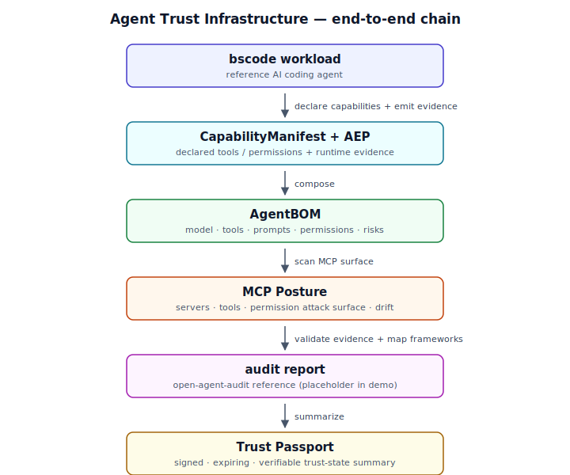

# Agent Trust Infrastructure

Public research preview for Agent Trust Infrastructure: AgentBOM, MCP posture, and trust passport specifications for auditable AI agents.

> **Status: experimental research preview — end-to-end trust-chain demo shipped.**
> Not production software.
> Not a compliance certification product.

> **Source of truth for trust artifacts.** This repository is the canonical home
> for the AgentBOM, MCP Posture, and Trust Passport specifications and reference
> implementations consumed across the WasmAgent organization — including the
> `wasmagent-js` runtime, which depends on the artifact schemas defined here. The
> specifications and schemas are authoritative; the *implementation maturity*
> remains an experimental research preview (see status above).

## Why this exists

AI agents are becoming deployable software systems with tools, permissions, model dependencies, runtime policies, and audit evidence.

Traditional logs and observability traces are not enough to answer enterprise trust questions:

- What is this agent made of?
- Which tools and MCP servers can it access?
- What permissions can it exercise?
- Which risks changed since the last review?
- Which audit evidence supports its trust claims?
- Is there a signed, expiring trust state that a buyer or reviewer can verify?

This repository explores three connected trust artifacts:

1. **AgentBOM** — a bill of materials for AI agents.
2. **MCP Posture** — attack surface and permission posture for MCP-connected agents.
3. **Trust Passport** — a signed, expiring, verifiable trust-state artifact.

## Relationship to WasmAgent

```
wasmagent-js
 runtime protection / MCP firewall / AEP emitter / CapabilityManifest
        ↓
Agent Trust Infrastructure
 AgentBOM / MCP Posture / Trust Passport specs and prototypes
        ↓
open-agent-audit / Trustavo
 evidence validation / audit report / framework mapping
        ↓
Trustavo Passport
 signed / expiring / verifiable trust state
 eventual product home: trustavo.com/passport
```

## Repository structure

```
agent-trust-infra/
├── docs/          — vision, architecture, boundaries, roadmap
├── specs/         — AgentBOM, MCP Posture, Trust Passport specifications
├── packages/      — TypeScript reference implementations (no CLI dependency)
├── cli/           — agent-trust unified CLI
├── examples/      — demo fixtures and end-to-end demos
└── papers/        — technical reports
```

## How the pieces fit together

The trust artifacts form a single chain that runs from a workload to a
verifiable, expiring trust state. Each link is generated from runtime facts and
validated by the `agent-trust` CLI:



```
bscode workload
      ↓ declare capabilities + emit evidence
CapabilityManifest + AEP
      ↓ compose
AgentBOM                  → what is this agent made of?
      ↓ scan MCP surface
MCP Posture               → what is the permission attack surface?
      ↓ validate evidence + map frameworks
audit report              → open-agent-audit reference
      ↓ summarize
Trust Passport            → signed, expiring, verifiable trust state
```

The `agent-trust chain` command walks this entire chain in-process and offline,
emitting one JSON object per step and writing `chain-report.json` with a
per-step `verdict`, `duration_ms`, and `output_hash`.

### Run the full chain

```bash
bun install
bash examples/bscode-agent/run-chain.sh
cat examples/bscode-agent/chain-report.json
```

For the rationale and architecture behind this chain, see the short technical
report: [Agent Trust Infrastructure](papers/agent-trust-infrastructure.md).

## Quick start

```bash
bun install
bun test

# Validate an AgentBOM
agent-trust agentbom validate examples/agentbom-demo/agentbom.json

# Validate a posture snapshot
agent-trust mcp-posture validate examples/mcp-risk-demo/posture.json

# Validate a Trust Passport
agent-trust passport validate examples/passport-demo/trust-passport.json
```

## Repository status

This repository is a public research preview.

The specifications and prototypes may change rapidly.
Do not treat any artifact here as a legal compliance certification, security certification, or production-grade audit attestation.

### Roadmap status

**Shipped (Weeks 0–12):** repo and spec skeletons, working examples with JSON
schemas and validators, and the end-to-end trust-chain demo are complete and
recorded in the [`Changelog`](docs/CHANGELOG.md).

- **Weeks 0–2 — repo and spec skeletons:** public repo, vision/architecture/boundaries docs, and spec skeletons. ✅
- **Weeks 2–6 — working examples:** JSON schemas and validators for AgentBOM, MCP Posture, and Trust Passport, plus fixture-based tests. ✅
- **Weeks 6–12 — end-to-end demo:** the full trust chain is wired up — one command (`agent-trust chain` / `examples/bscode-agent/run-chain.sh`) walks `bscode → CapabilityManifest + AEP → AgentBOM → MCP Posture → audit report → Trust Passport` offline, with an architecture diagram and a runnable demo. ✅

[`docs/roadmap.md`](docs/roadmap.md) now lists only future and in-flight work:
split criteria, federation with `open-agent-audit` / `trace-pipeline`,
cryptographic Passport signing, and a static site for `papers/`, tracked as
follow-up issues.

## License

Apache-2.0
